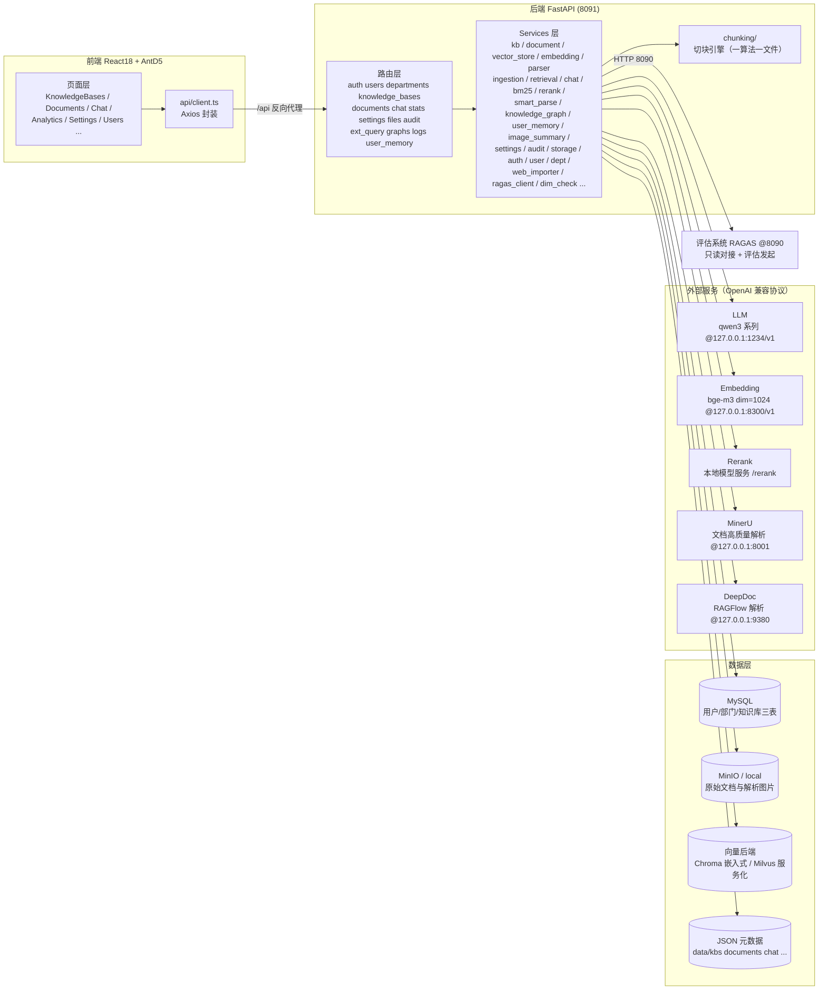

# my-RAG 知识库系统 — 架构文档

本文档描述 RAG 子系统的整体架构、模块职责与关键流程。快速上手与接口契约见
[README.md](./README.md) 与 [docs/API接口契约.md](./docs/API接口契约.md)。

## 1. 总体架构

### 1.1 系统架构图（mermaid）



> ASCII 版架构图（与 README 一致）见文末附录 A。

### 1.2 RAG 检索链路图（mermaid）

```mermaid
flowchart LR
    A[用户问题] --> B[多知识库选择 kb_ids<br/>top_k / 相似度阈值]
    B --> C1[向量检索<br/>Chroma / Milvus + bge-m3]
    B --> C2[BM25 混合检索<br/>jieba 中文分词]
    C1 --> D[RRF 融合排序]
    C2 --> D
    D --> E{配置了 Rerank?}
    E -->|是| F[Rerank 重排序<br/>本地模型服务]
    E -->|否| G[直接取 top_k 结果]
    F --> G
    G --> H[上下文组装<br/>父块优先 / 引用标注]
    H --> I[LLM 流式回答<br/>SSE: meta→delta→done]
    I --> J[强制引用溯源<br/>句末 [n] + 来源片段]

    style A fill:#e8f4fd
    style J fill:#e8f4fd
```

### 1.3 文档入库链路

```
上传（txt/md/pdf/docx/xlsx/xls/csv/ppt/pptx ≤100MB / URL 网页导入）
    ↓
解析：MinerU 高质量解析（含图片提取）→ 不可用自动降级 pypdf / python-docx；
      docx 规范类文档可走规范条文解析（normative，章节层级识别）；
      复杂版式可指定 DeepDoc（RAGFlow）；Excel/CSV 本地结构化直读（spreadsheet 读取器，
      直接产出管道表格）；图片摘要可用多模态模型把图内文字读成描述回填正文
    ↓
切块：通用 / 按标题 / 正则 / 父子分块 / QA 问答 / Agentic 智能分块 /
      层级聚合切块（保留章节树，父块供检索、子块供引用）
      （chunk_size / chunk_overlap 可配；Agentic 为 LLM 读全文语义切块，≤1 万字，
        原理见 docs/Agentic智能分块原理.md、docs/层级聚合切块原理.md）
    ↓
向量化：bge-m3（批量 32、超长截断 8000 字符）+ 维度检测
    ↓
存储：向量 → 向量后端（VECTOR_BACKEND=chroma|milvus）；原始文档/图片 → MinIO 或 local；
      元数据 → data/*.json + MySQL；知识图谱 → data/storage/graphs/{kb_id}.json
    ↓
状态机：uploaded → parsing → parsed → ingested / failed（前端轮询展示）
```

## 2. 模块目录说明

### 2.1 后端（backend/）

| 目录/文件 | 职责 |
|-----------|------|
| `main.py` | 入口：app 初始化、lifespan（init_db + 存储桶 ensure）、路由注册 |
| `config.py` | 全局配置（pydantic-settings，环境变量优先，.env 为出厂默认） |
| `db.py` / `deps.py` | 数据库引擎与会话管理 / 认证依赖（JWT、角色校验） |
| `models/` | Pydantic / ORM 模型：rag_models（知识库/文档/聊天）、user_models（用户/部门）、ext_query_models（外部查询访问记录） |
| `routers/auth.py` | 登录、当前用户、改密（JWT 签发/校验，登录限流） |
| `routers/users.py` `departments.py` | 用户/部门管理（仅超管） |
| `routers/knowledge_bases.py` | 知识库 CRUD、标签、向量重建 |
| `routers/documents/crud.py` | 文档明细、原始内容预览、上传/解析/重命名/回收站（prefix `/api/kbs/{kb_id}/documents`） |
| `routers/documents/admin.py` | 超管跨库文档管理（全库文档视图） |
| `routers/documents/smart_parse.py` | 智能解析：文档画像分析与推荐解析方案 |
| `routers/chat.py` | SSE 流式问答、检索接口、会话历史 CRUD/重命名/导出 |
| `routers/stats.py` | 检索质量统计、用户反馈、RAGAS 只读对接与评估发起 |
| `routers/graphs.py` | 知识图谱查询（实体/关系，按实体搜索子网） |
| `routers/settings.py` | 配置档案 CRUD/激活/连接测试、embedding 维度查询 |
| `routers/files.py` | 图片/文件鉴权代理输出（?token= 或 Bearer） |
| `routers/audit.py` | 审计日志查询（仅超管） |
| `routers/logs.py` | 日志查看（总览/健康/实时 tail/文件/区间） |
| `routers/ext_query.py` | 外部查询：管理端 `/api/ext-queries`（含总览/访问记录/续期）+ 对外免账号问答 `/api/ext/{id}`（含图片代理） |
| `routers/user_memory.py` | 用户记忆读写（`/api/users/{user_id}/memory`） |
| `services/kb_service.py` `document_service.py` | 知识库/文档元数据（JSON + MySQL） |
| `services/vector_store.py` | 向量后端抽象（`VectorBackend`）：Chroma 嵌入式 / Milvus 服务化，软删除过滤 |
| `services/embedding_service.py` | bge-m3 向量化（批量/截断/失败降级） |
| `services/parsers/` | 解析链路：`client`（MinerU / 纯文本 / DeepDoc 调度）、`deepdoc`、`probe(s)`、`images`、`gotenberg`（office 转换） |
| `services/smart_parse/` | 智能解析：`profiling` 画像 → `plan` 方案 → `cost` 成本预估 → `engine` 执行 |
| `services/ingestion/` | 入库状态机编排（params 参数校验 / trace 轨迹 / images 图片链 / service 主体，并发信号量） |
| `services/retrieval_service.py` `contextual_retriever.py` | 混合检索、RRF 融合、父子块回填、多库合并 |
| `services/bm25.py` `rerank_client.py` | BM25 中文分词索引 / Rerank 客户端（未配置自动跳过） |
| `services/query_rewriter.py` `thinking_strategy.py` | 查询改写 / Agentic 决策阶段（检索中·改写中·重新检索中） |
| `services/chat_service.py` | SSE 流式问答、强制引用溯源、多轮上下文 |
| `services/knowledge_graph_service.py` | 知识图谱：LLM 抽取实体关系、子网查询（data/storage/graphs） |
| `services/user_memory_service.py` | 用户记忆/画像的读写与问答注入 |
| `services/image_summary.py` | 图片摘要（多模态模型读图回填正文） |
| `services/ext_query_service.py` | 外部查询：链接与令牌管理、有效期与续期、访问记录落库（含来源 IP）、免账号问答会话 |
| `services/feedback_service.py` | 用户反馈（点赞点踩 + 原因 + 会话回溯） |
| `services/rate_limit.py` | 限流（登录等敏感接口） |
| `services/dim_check.py` | 向量维度检测 + 后台重建任务（轮询进度） |
| `services/retrieval_log.py` | 检索质量日志（近 30 天命中率/零命中） |
| `services/ragas_client.py` `ragas_sampling.py` | RAGAS(8090) 只读/评估发起对接、真实问答采样 |
| `services/settings/service.py` | 配置档案（data/settings.json，多档案 + 连接测试） |
| `services/audit_service.py` | 审计日志落库（MySQL） |
| `services/storage_service.py` | 对象存储抽象（MinIO / local 可切换） |
| `services/auth_service.py` `user_service.py` `department_service.py` | 多租户认证与账号体系 |
| `services/web_importer.py` | URL 网页导入 |
| `services/agentic_chunker.py` `agentic_service.py` | Agentic 智能分块（异步 LLM 语义切块） |
| `services/table_normalizer.py` `text_cleanup.py` `llm_client.py` | 表格规范化 / 文本清洗 / LLM 客户端 |
| `chunking/` | 切块引擎，一个算法一个文件（`recursive` 通用 / `markdown_splitter` 按标题 / `regex_chunker` 正则 / `parent_child` 父子分块 / `qa_chunker` QA 问答 / `heading_presets` 层级聚合） |
| `normative/` | 规范条文解析（`docx_parser` / `chunker` / `heading_llm`） |

### 2.2 前端（frontend/src/modules/）

按业务模块组织，模块内自带 `components/`；跨模块复用的 API 封装、布局与通用组件放在 `shared/`。

| 模块 | 职责 |
|------|------|
| `auth/` | 登录页 |
| `knowledge/` | 知识库列表/创建/标签/文档管理入口；知识图谱 Tab |
| `documents/` | 文档上传、解析、回收站、重命名；切块详情；智能解析向导；全部门文档视图（`GlobalDocuments`） |
| `chat/` | 流式问答（SSE）、会话历史/重命名/导出、引用溯源弹窗 |
| `retrieval/` | 检索测试（多库/混合/重排参数调试、向量分与重排分对比） |
| `analytics/` | 系统统计 + 检索质量 + RAGAS 评测 + 用户反馈（含会话回溯抽屉） |
| `ext-queries/` | 外部查询（总览卡片 / 链接配置 / 访问记录与明细）与对外问答页 |
| `settings/` | 配置档案（容器 + 各分组面板：llm / embedding / mineru / deepdoc / retrieval / ingest / 图片摘要 / mysql / minio / 向量后端） |
| `logs/` | 日志查看（操作审计 / 系统日志文件 / 实时系统日志） |
| `users/` | 用户/部门管理（超管） |
| `profile/` | 个人资料、改密、用户记忆 |
| `shared/` | `api/`（client + 各域接口与 types）、`auth/`、`components/`、`hooks/`、`utils/` |

## 3. 关键流程

### 3.1 配置即时生效

外部服务地址/模型/参数全部在「系统配置」页可改、可测、可多档案切换，保存后无需
重启；运行时各 service 每次调用动态读取活跃档案（`.env` 仅作出厂默认值）。

### 3.2 权限模型简表

| 角色 | 范围 | 能力 |
|------|------|------|
| `super_admin` | 全局 | 用户/部门管理、审计日志、全部知识库、系统配置 |
| `dept_admin` | 本部门 | 本部门知识库管理、本部门成员管理、发起 RAGAS 评估 |
| `user` | 个人 | 自己创建的知识库 + 被授权的库（部门/共享） |

- 越权访问统一返回 404 伪装（防探测）；文档/图片/检索均做归属校验。
- 认证：JWT（access_token），bcrypt 口令哈希，会话/配置变更入审计日志。

### 3.3 软删除

DELETE 文档 = 移入回收站（向量/存储保留，检索排除）→ 恢复（无需重新解析）→
purge 才物理删除；知识库级联删除同样先入回收站。

## 附录 A：ASCII 架构图（与 README 一致）

```
前端 React18 + AntD5 (dev 3002 / 生产 nginx 托管 dist)
        │  /api 反向代理
后端 FastAPI (8091)   ←── 路由层: auth/users/departments/kbs/documents/chat/stats/settings/files/audit
        │                    ext_query/graphs/logs/user_memory
        ├── services 层（模块化，可单独替换）
        │   ├── kb_service / document_service   元数据（data/kbs、data/documents）+ MySQL 三表
        │   ├── vector_store                    向量后端抽象：Chroma（嵌入式）/ Milvus（服务化）
        │   ├── embedding_service               bge-m3（批量 32 / 截断 8000 字符）
        │   ├── parsers/                        MinerU / DeepDoc / 规范条文 / 表格 / 纯文本降级
        │   ├── smart_parse/                    智能解析：画像 → 方案 → 成本预估 → 执行
        │   ├── ingestion/                      上传→解析→切块→向量化 状态机（params/trace/images/service）
        │   ├── retrieval_service / chat_service 向量+BM25 混合 / rerank / SSE 流式（引用标注）
        │   ├── contextual_retriever / query_rewriter / thinking_strategy  检索增强
        │   ├── knowledge_graph_service         知识图谱（LLM 抽取实体关系，data/storage/graphs）
        │   ├── user_memory_service             用户记忆/画像
        │   ├── image_summary                   图片摘要（多模态模型读图回填正文）
        │   ├── ext_query_service / rate_limit  外部查询 / 限流
        │   ├── feedback_service / retrieval_log 用户反馈 / 检索质量日志
        │   ├── dim_check                       向量维度检测 + 后台重建任务
        │   ├── stats_service / ragas_client    自身统计 + RAGAS(8090) 只读对接
        │   ├── settings_service                配置档案（data/settings.json，多档案+连接测试）
        │   ├── audit_service / storage_service 审计日志（MySQL）/ 对象存储（MinIO / local）
        │   └── auth_service / user_service / department_service / kb_service（多租户）
        │
        ├── chunking/       通用 / 按标题 / 正则 / 父子 / QA / Agentic / 层级聚合
        ├── normative/      规范条文解析（docx_parser / chunker / heading_llm）
        │
        ├── 外部服务（OpenAI 兼容协议）
        │   ├── LLM:    qwen3.6-35b-a3b-apex-quality @ 127.0.0.1:1234/v1 (LM Studio)
        │   ├── Embedding: bge-m3 (dim=1024) @ 127.0.0.1:8300/v1 (vLLM)
        │   ├── Rerank: 需本地模型服务（配置档案开启，见 docs/外部依赖部署指南.md）
        │   ├── MinerU: http://127.0.0.1:8001（Docker 部署）
        │   ├── DeepDoc: http://127.0.0.1:9380（RAGFlow，可选）
        │   ├── MySQL:  127.0.0.1:5455（多租户三表）
        │   ├── MinIO:  127.0.0.1:9000（对象存储）
        │   └── Milvus: 127.0.0.1:19530（可选，VECTOR_BACKEND=milvus 时使用）
        └── RAGAS 评估系统 @ http://localhost:8090（只读对接：任务列表 + 报告）
        └── MCP Server（mcp-server/）：向 AI Agent 暴露 kb_query 查询能力
```
