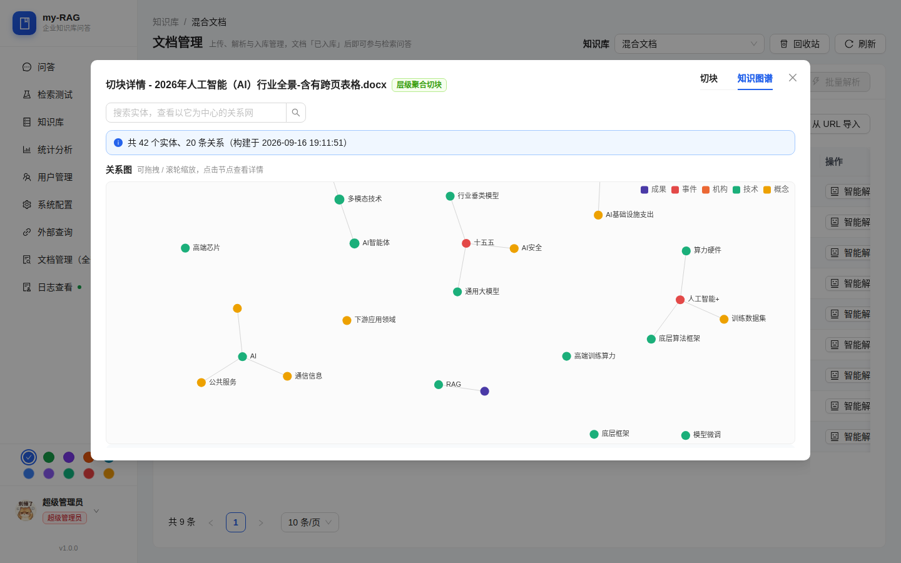
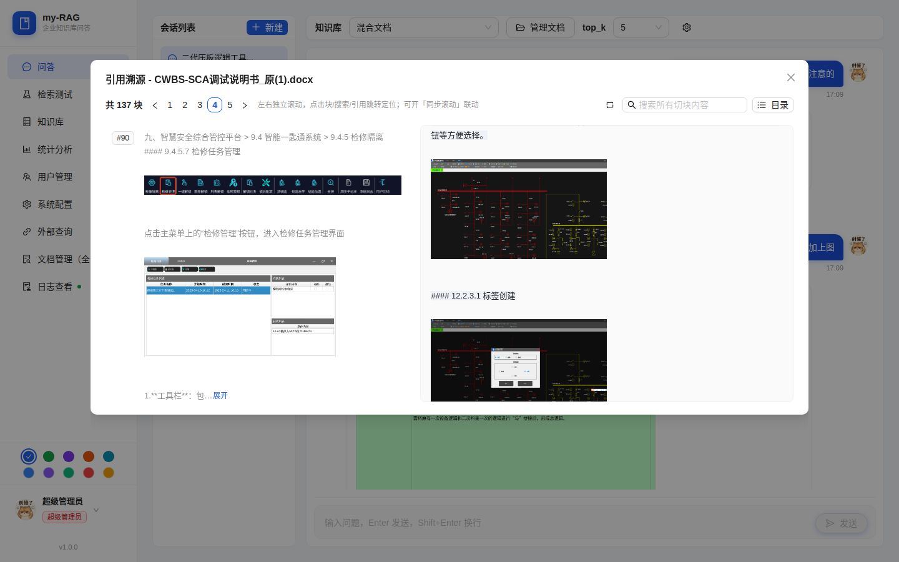
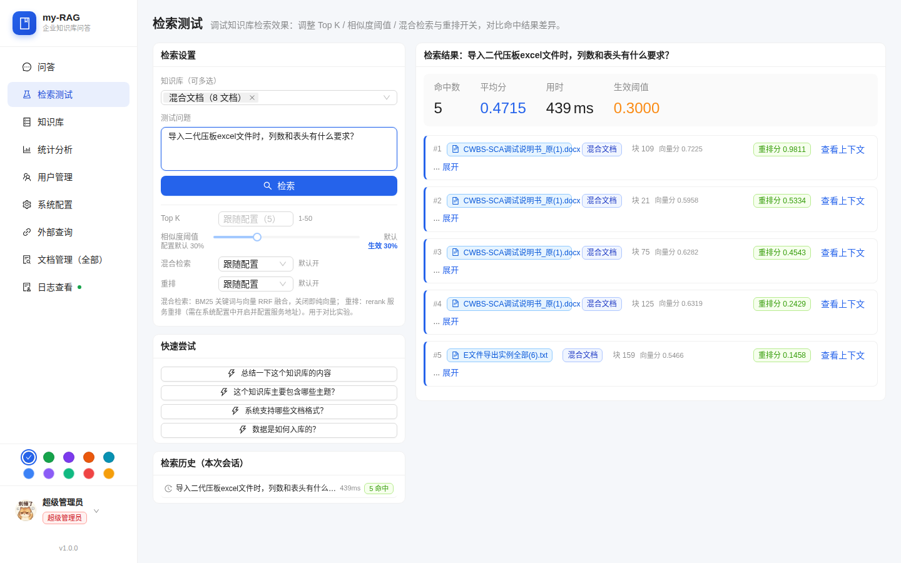
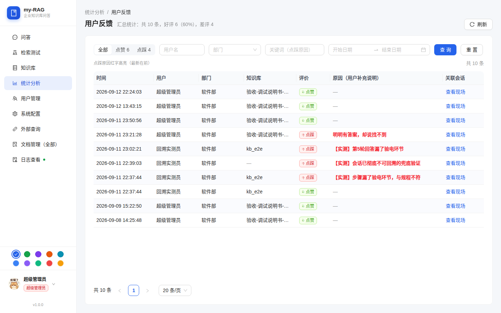
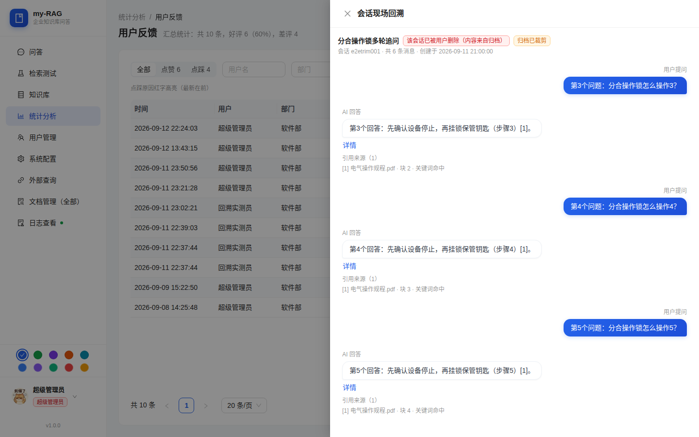
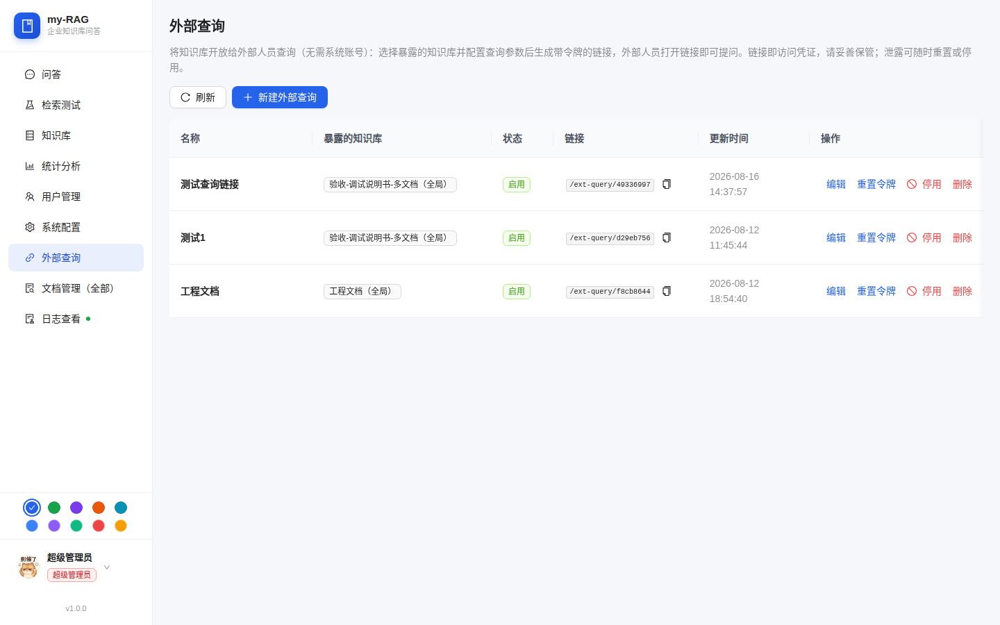
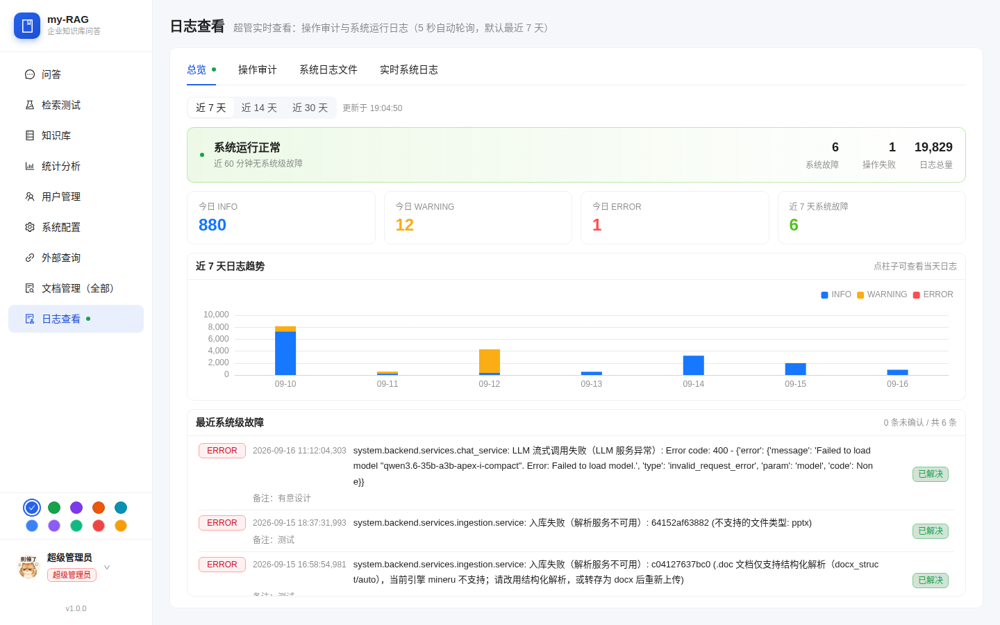
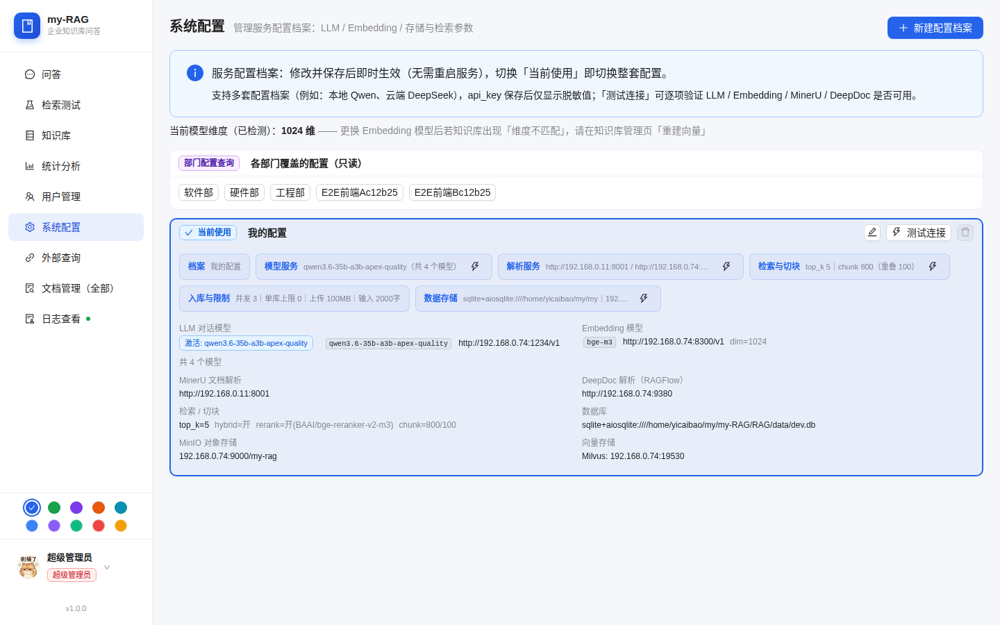
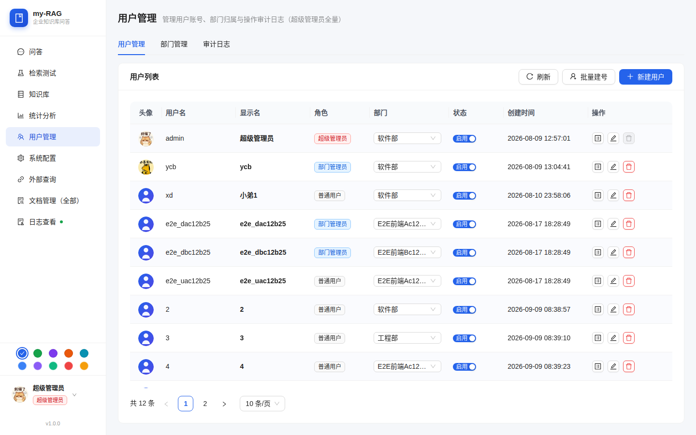

# my-RAG 企业知识库问答系统

本地化部署的企业知识库问答系统：**文档上传 → 多引擎解析 → 多策略切块 → 混合检索 → 流式问答**
（强制引用溯源）。配套 RAGAS 评估闭环、知识图谱、外部查询、MCP 接入与完整的多租户治理。

技术栈：**FastAPI + React 18/AntD 5**，向量后端支持 **Chroma（嵌入式）/ Milvus（服务化）** 插拔切换，
外部模型全部走 OpenAI 兼容协议（LLM / Embedding / Rerank 均可替换）。

## 项目特色

### 检索过程全透明（不是黑盒）

- **检索测试页**：并排展示每条命中的**向量相似度**与**重排序分数**、块号、耗时与生效阈值，
  TopK / 相似度阈值 / 混合检索 / 重排开关均可现场调整，用于对比不同参数下的命中差异
- **引用溯源**：回答句末 `[n]` 引用标可点击，直达原文档对应切块并**高亮对齐**（原文与引用一一对应）
- **入库全流程 trace**：每篇文档记录解析 → 切块 → 向量化各阶段耗时，失败原因可见

### 七种切块策略，按文档类型选

通用切块 / 按标题切块 / 正则切块 / **父子分块** / **QA 问答对切块** / **Agentic 智能分块**（LLM 语义切块）/
**层级聚合切块**（保留章节树，父块供检索、子块供引用）。

### 五种解析引擎，可降级

| 引擎 | 说明 |
|---|---|
| **MinerU** | 高质量解析（版面还原 + 图片提取，图片经鉴权代理输出） |
| **DeepDoc** | RAGFlow 解析服务，适合复杂版式 |
| **规范条文解析** | docx 规范类文档专用（章节层级识别） |
| **表格结构化直读** | Excel/CSV 直读为管道表格入库，保公式与跨页表 |
| **纯文本降级** | pypdf / python-docx，外部服务不可用时兜底 |

### 向量后端可插拔

`VECTOR_BACKEND=chroma|milvus`：**Chroma** 嵌入式零依赖零运维，**Milvus** 服务化支撑更大规模。
检索层不感知后端差异；换 Embedding 模型后可一键重建向量。

### 对外能力：不止内部使用

- **外部查询**：把指定知识库以**带令牌的链接**开放给外部人员，无需系统账号即可提问；
  链接即凭证，可随时**重置令牌** / **停用** / **设有效期**（到期自动失效，支持续期），令牌获取带审计；
  支持参数定制（TopK、输出长度、是否在回答与引用里展示文档图片等）；
  所有外部访问**落库可查**（来源 IP / 时间 / 问题 / 命中数），既能按链接下钻审计，也能发现异常刷量
- **MCP 接入**：内置 MCP Server，AI Agent（如 PiAgent）通过 `kb_query` 工具直接查询企业知识库

### 评估与反馈闭环

- **RAGAS 评测**：对接 RAGAS 评估系统，展示任务列表与逐样本评分报告（未部署时自动降级）
- **检索质量统计**：近 30 天命中率、命中 Top 文档、零命中文档排行
- **用户反馈 + 会话回溯**：点赞/点踩附原因，可点「查看现场」**回溯原始问答现场**——
  即使该会话已被用户删除，仍可从归档中读回（截图见下）

### 知识图谱

解析时可选用 LLM 抽取实体与关系，构建文档知识图谱；支持按实体搜索、查看以它为中心的 N 层关系网。

### 企业级治理

多租户（部门 + 创建人）/ 三级角色 / 无权限 404 伪装防探测 / 审计日志 / 登录限流 /
配置档案热切换（保存即生效，逐项连接测试，api_key 脱敏）/ 实时日志查看。

## 界面预览

> 截图来自实际运行环境，1440×900。

| 页面 | 说明 |
| --- | --- |
|  | **登录页**：账号密码登录，支持记住账号 |
|  | **知识库**：卡片式展示，标签筛选 / 搜索 / 新建 / 外部查询入口 |
|  | **文档管理**：上传、解析入库、状态与切块数一目了然；每篇标注所用切块方式 |
|  | **切块详情**：左栏切块列表 + 右栏原文高亮双向联动；支持目录跳转与全文搜索 |
|  | **知识图谱**：实体关系可视化；可按实体搜索查看中心关系网 |
|  | **智能问答**：流式输出，回答句末 `[n]` 引用标 + 来源片段 |
|  | **引用溯源**：点击 `[n]` 直达原文档切块，原文与回答**对齐高亮** |
|  | **检索测试**：向量分与重排分并列展示，参数可现场调整对比 |
|  | **统计分析**：系统运行统计 + 检索质量 + RAGAS 评测 + 用户反馈 |
|  | **用户反馈**：点赞点踩汇总、点踩原因高亮、多维筛选 |
|  | **会话回溯**：回溯原始问答现场，会话已删除仍可从归档读回 |
|  | **外部查询**：链接总览（配置 / 记录入口卡片）+ 带令牌的对外链接，可设有效期 / 重置令牌 / 停用，访问记录可查来源 IP |
|  | **日志查看**：日志趋势、今日各级别计数、系统级故障标记与处理 |
|  | **系统配置**：多套配置档案热切换，LLM / Embedding / 解析 / 检索分组展示 |
|  | **用户管理**：用户 / 部门 / 审计日志三页签 |

## 功能全景

### 知识库与文档

- 知识库 CRUD（级联删除），多租户归属（部门 + 创建人），标签体系（设置/聚合/过滤）
- 文档上传（txt/md/pdf/docx/xlsx/xls/csv/ppt/pptx，≤100MB）+ **URL 网页导入** + 中文文件名安全（内部 UUID 命名）
- **回收站**：软删除（检索自动排除、向量保留）→ 恢复（无需重新解析）→ 彻底删除 / 一键清空
- 批量导入并解析、智能解析向导（按文档画像推荐解析与切块参数）、图片摘要（多模态模型把图内文字读成描述回填正文）

### 检索与问答

- **混合检索**（BM25 中文分词 + 向量 RRF 融合）+ **Rerank 重排序**（OpenAI 兼容 `/rerank`）
- 检索参数化：TopK / 相似度阈值 / **多库对比检索（1~5 个库合并排序）**
- SSH 流式问答（meta → delta → done），多轮对话，会话重命名 / 导出 Markdown
- 上下文检索、查询改写、Agentic 决策阶段进度提示（检索中/改写中/重新检索中）

### 企业级能力

- **多租户 + 团队协作**：用户 / 部门 / 知识库三表，角色权限（super_admin / dept_admin / user），无权限 404 伪装
- **审计日志**：全操作记录，分页查询 + 过滤，仅超管可查
- **对象存储**：MinIO 存原始文档与解析图片（local 后端可离线），图片经鉴权代理输出
- **配置档案**：LLM / Embedding / MinerU / DeepDoc / 检索 / 切块 / 会话 / MySQL / MinIO 多档案，切换即时生效 + 逐项连接测试
- **用户记忆**：按用户维护画像/记忆，问答时注入

### 运维

- 一键部署脚本（源码 / Docker 双路径）、健康检查、日志审计、数据持久化（`data/` 或 MinIO）
- **日志查看**：日志趋势图、级别计数、系统级故障识别与标记（5 秒自动轮询）
- 端到端验证脚本 `scripts/verify.sh`（22 步，含全部新增功能）

## 架构

```
前端 React18 + AntD5 (dev 3002 / 生产 nginx 托管 dist)
        │  /api 反向代理
后端 FastAPI (8091)   ←── 路由层: auth/users/departments/kbs/documents/chat/stats/settings/files/audit
        │                    ext_query/graphs/logs/user_memory
        ├── services 层（模块化，可单独替换）
        │   ├── kb_service / document_service   元数据（data/kbs、data/documents）+ MySQL 三表
        │   ├── vector_store                   向量后端抽象：Chroma（嵌入式）/ Milvus（服务化）
        │   ├── embedding_service               bge-m3（批量 32 / 截断 8000 字符）
        │   ├── parsers/                        MinerU / DeepDoc / 规范条文 / 表格 / 纯文本降级
        │   ├── smart_parse/                    智能解析：画像 → 方案 → 成本预估 → 执行
        │   ├── ingestion/                      上传→解析→切块→向量化 状态机（params/trace/images/service）
        │   ├── retrieval_service / chat_service 向量+BM25 混合 / rerank / SSE 流式（引用标注）
        │   ├── contextual_retriever / query_rewriter / thinking_strategy  检索增强
        │   ├── knowledge_graph_service         知识图谱（LLM 抽取实体关系，data/storage/graphs）
        │   ├── user_memory_service             用户记忆/画像
        │   ├── image_summary                   图片摘要（多模态模型读图回填正文）
        │   ├── ext_query_service / rate_limit  外部查询 / 限流
        │   ├── feedback_service / retrieval_log 用户反馈 / 检索质量日志
        │   ├── dim_check                       向量维度检测 + 后台重建任务
        │   ├── stats_service / ragas_client    自身统计 + RAGAS(8090) 只读对接
        │   ├── settings_service                配置档案（data/settings.json，多档案+连接测试）
        │   ├── audit_service / storage_service 审计日志（MySQL）/ 对象存储（MinIO / local）
        │   └── auth_service / user_service / department_service / kb_service（多租户）
        │
        ├── chunking/       通用 / 按标题 / 正则 / 父子 / QA / Agentic / 层级聚合
        ├── normative/      规范条文解析（docx_parser / chunker / heading_llm）
        │
        ├── 外部服务（OpenAI 兼容协议）
        │   ├── LLM:    qwen3.6-35b-a3b-apex-quality @ 127.0.0.1:1234/v1 (LM Studio)
        │   ├── Embedding: bge-m3 (dim=1024) @ 127.0.0.1:8300/v1 (vLLM)
        │   ├── Rerank: 需本地模型服务（配置档案开启，见 docs/外部依赖部署指南.md）
        │   ├── MinerU: http://127.0.0.1:8001（Docker 部署）
        │   ├── DeepDoc: http://127.0.0.1:9380（RAGFlow，可选）
        │   ├── MySQL:  127.0.0.1:5455（多租户三表）
        │   ├── MinIO:  127.0.0.1:9000（对象存储）
        │   └── Milvus: 127.0.0.1:19530（可选，VECTOR_BACKEND=milvus 时使用）
        └── RAGAS 评估系统 @ http://localhost:8090（只读对接：任务列表 + 报告）
        └── MCP Server（mcp-server/）：向 AI Agent 暴露 kb_query 查询能力
```

关键机制：

- **配置即时生效**：外部服务地址/模型/参数全部在「系统配置」页可改、可测、可多档案切换，
  保存后无需重启；运行时各 service 每次调用动态读取活跃档案（.env 仅作出厂默认值）。
- **幻觉抑制**：system prompt 强制「只依据引用回答 + 句末 [n] 标注来源 + 无答案明说」。
- **状态机**：文档 uploaded → parsing → parsed → ingested / failed，前端轮询展示。
- **软删除**：DELETE 文档 = 移入回收站（向量/存储保留，检索排除），purge 才物理删除。
- **中文路径安全**：文件内部统一 UUID 命名，原名仅存 JSON（ensure_ascii=False）。

## 快速开始

### 必改清单（首次部署前逐项确认）

> 详细说明（各服务的获取方式 / 端口 / 可降级性）见 **`docs/外部依赖部署指南.md`**。

1. **JWT_SECRET**：`cp .env.example .env` 后，必须把 `.env` 中 `JWT_SECRET`
   改为 ≥16 字符的强随机值（`openssl rand -hex 32` 生成），否则后端**拒绝启动**。
2. **MySQL 连接**：登录/多租户依赖 MySQL，未配置则无法登录。填写
   `MYSQL_HOST` / `MYSQL_PORT` / `MYSQL_USER` / `MYSQL_PASSWORD` / `MYSQL_DATABASE`
   （Docker 部署填 `docker/.env.docker`；也可用
   `docker compose -f docker/docker-compose.infra.yml up -d mysql` 一键起库）。
3. **MinIO 或 local 存储**：有 MinIO 则填 `MINIO_ENDPOINT` / `MINIO_ACCESS_KEY` /
   `MINIO_SECRET_KEY`（或 `docker compose -f docker/docker-compose.infra.yml up -d minio`
   一键启动）；无 MinIO 时设 `STORAGE_BACKEND=local`（对象存本地 `data/storage`）。
4. **向量后端**：默认 `VECTOR_BACKEND=chroma`（嵌入式，零依赖）；改用 Milvus 时设
   `VECTOR_BACKEND=milvus` 并填 `MILVUS_URI`（如 `http://127.0.0.1:19530`）。

### 路径一：源码部署（dev 开发，热更新，推荐日常开发）

所有部署脚本统一放在 `deploy/` 目录（install.sh 装依赖 / build.sh 编译前端 /
start.sh 启动 / stop.sh 停止）：

```bash
./deploy/install.sh   # 首次：创建 .venv → 装后端依赖 → 装前端依赖（幂等）
./deploy/start.sh     # 建/复用 .venv → 装依赖 → 构建前端 → 起后端 8091 → 起前端 dev 3002
./deploy/stop.sh      # 停止前后端
```

- 后端 API: http://localhost:8091 （健康检查 `/api/health`）
- 前端: http://localhost:3002

手动模式（不依赖脚本）：
```bash
# 后端（Python 3.12）
python3.12 -m venv .venv && .venv/bin/pip install -r requirements.txt
PYTHONPATH=. .venv/bin/python -m uvicorn backend.main:app --host 0.0.0.0 --port 8091 --reload

# 前端（Node 22）
cd frontend && npm install && npm run dev
```

> requirements.txt 有增删后需强制重装：`./deploy/install.sh --force`

### 路径二：Docker 部署（生产）

```bash
cp docker/.env.docker.example docker/.env.docker   # 生成后编辑 docker/.env.docker
docker compose -f docker/docker-compose.yml up -d --build   # 构建并后台启动
docker compose -f docker/docker-compose.yml logs -f         # 查看日志
docker compose -f docker/docker-compose.yml down            # 停止（数据卷 ../data 保留）
```

- 前端: http://localhost （nginx，SPA 路由 + /api 反代 8091）
- 后端 API: http://localhost:8091/api/health
- 详细说明（含配置字段、Rerank 档案配置、已知限制）见 `docker/README.md`

### 端到端验证

```bash
# 后端 8091 运行中时执行（自建数据、自清理；网络/外部依赖不可用步骤自动 SKIP）
bash scripts/verify.sh
```

### 测试

```bash
pytest                    # 101 个测试文件 / 1662 个用例，离线可跑
```

## API 文档

完整接口契约见 **`docs/API接口契约.md`**，模块说明见 **`docs/模块说明.md`**。
全局约定：认证/角色/错误码。

快速索引：

| 模块 | 接口 |
|---|---|
| 认证 | `POST /api/auth/login` `GET /api/auth/me` `POST /api/auth/change-password` |
| 用户/部门 | `/api/users`（CRUD，仅超管） `/api/departments`（CRUD，仅超管） |
| 知识库 | `GET/POST /api/kbs` `GET/PUT/DELETE /api/kbs/{id}` `GET /api/kbs?tag=` |
| 标签 | `GET /api/kbs/tags` `PUT /api/kbs/{id}/tags` |
| 向量重建 | `GET /api/kbs/{id}/vector-status` `POST /api/kbs/{id}/rebuild-vectors` `GET /api/kbs/{id}/rebuild-status` |
| 文档 | `POST /api/kbs/{kb_id}/documents/upload` `POST .../from-url` `POST .../{id}/ingest` `POST .../{id}/rename` `GET .../{id}/raw` |
| 智能解析 | `GET /api/kbs/{kb_id}/documents/{doc_id}/analyze`（文档画像与推荐解析方案） |
| 回收站 | `GET /api/admin/documents/trash` `POST .../trash/empty` `DELETE .../{id}`（软删） `POST .../{id}/restore` `POST .../{id}/purge` |
| 聊天 | `POST /api/chat/stream`（SSE） `POST /api/chat/retrieve` `GET /api/chat/history` `GET/DELETE /api/chat/history/{id}` `POST .../rename` `GET .../export` |
| 知识图谱 | `GET /api/kbs/{kb_id}/graph`（实体/关系，支持按实体搜索子网） |
| 统计 | `GET /api/stats` `GET /api/stats/quality?kb_id=` `GET /api/stats/ragas` `GET /api/stats/ragas/tasks/{id}` |
| 用户反馈 | `GET /api/stats/feedback`（汇总 + 记录，含会话回溯所需 session_id） |
| 外部查询（管理） | `GET/POST /api/ext-queries` `PUT/DELETE /api/ext-queries/{id}` `POST /{id}/reset-token` `POST /{id}/toggle` `POST /{id}/renew`（续期） `GET /{id}/token` `GET /overview`（总览统计） `GET /logs`（访问记录，按链接/IP/时间段筛选） |
| 外部查询（对外） | `GET /api/ext/{id}/info` `POST /api/ext/{id}/chat` `POST /api/ext/{id}/query` `GET /api/ext/{id}/images/{doc_id}/{name}`（图片代理，仅暴露库） |
| 用户记忆 | `GET/PUT/DELETE /api/users/{user_id}/memory` |
| 日志 | `GET /api/logs/overview` `GET /api/logs/health` `POST /api/logs/ack` `GET /api/logs/tail` `GET /api/logs/segments` `GET /api/logs/files` |
| 审计 | `GET /api/audit/logs` `GET /api/audit/actions`（仅超管） |
| 文件 | `GET /api/files/images/{doc_id}/{name}?token=`（或 Bearer） |
| 配置 | `GET/POST/PUT/DELETE /api/settings/profiles` `POST /profiles/{id}/activate` `POST /profiles/{id}/test` `GET /api/settings/embedding-dim` |
| 健康 | `GET /api/health` |

## 配置说明

### .env（出厂默认值，运行时以配置档案优先）

复制 `.env.example` 为 `.env` 可覆盖出厂默认：端口/LLM/Embedding/MinerU/DeepDoc/检索/切块/
MySQL/MinIO/向量后端/JWT_SECRET。**运行时配置请在网页「系统配置」页修改**，
多档案持久化于 `data/settings.json`，切换档案即时生效。

### 系统配置页（数据档案，持久化到 data/settings.json）

每档案包含：LLM（base_url/api_key/model/temperature/max_tokens）、Embedding、
MinerU、DeepDoc、检索（top_k / similarity_threshold / enable_hybrid / **rerank**）、
切块（chunk_size/chunk_overlap）、入库限制、图片摘要、会话、MySQL、MinIO、向量后端。

- **Rerank**：检索分组下 `rerank` 段（enabled + base_url + model + top_n），
  需本地部署 OpenAI 兼容 /rerank 模型服务；未配置自动跳过重排（严格降级）
- **测试连接**：LLM/Embedding/MySQL/MinIO 各 5s 超时，MinerU 3s，逐项返回 成功(绿)/失败(红) + 耗时
- **api_key 脱敏**：接口返回脱敏值（前4\*\*\*\*后4）；编辑时未修改则保存保留原值
- **部门配置查询**：超管可只读查看各部门覆盖的配置，便于排查"为什么这个部门效果不同"

## 外部系统对接

### RAGAS 评估系统（端口 8090）

- 只读对接：`统计分析` 页展示 RAGAS 任务列表与评估报告（aggregate.scores + 逐样本评分）
- RAGAS 未运行时自动降级：页面 Alert 提示，自身统计不受影响
- 地址通过配置档案或 `RAGAS_BASE_URL` 配置；同仓库 `RAGAS/` 子项目可独立部署

### MinerU 文档解析（端口 8001）

- pdf/docx 优先走 MinerU 高质量解析（含图片提取，图片经 `/api/files/images/` 鉴权代理输出）；
  MinerU 未启动时自动降级 pypdf/python-docx 纯文本提取
- 扫描版 PDF 纯文本提取为空时状态置 `failed` 并提示「请启动 MinerU」

### DeepDoc 解析（RAGFlow，端口 9380，可选）

- 复杂版式文档可指定 `engine=deepdoc` 走 RAGFlow 解析服务
- 在「系统配置 → 解析服务」中配置地址与账号

### MCP Server（`mcp-server/`）

- 向 AI Agent 暴露 `kb_query` 工具：Agent 可通过外部查询链接直接检索企业知识库
- 接入方式见 `mcp-server/kbQuery-接入说明.md`

## 已知限制

- **MinerU 图片链路**：图片提取需 MinerU 侧开启 return_images，且需知识库权限（无权限 404 伪装）
- **Rerank 需本地模型服务**（OpenAI 兼容 /rerank 协议，如 vLLM rerank 接口），
  系统不内置模型；未配置时检索自动跳过重排
- **MySQL IP 白名单**：MySQL 用户若配置来源 IP 白名单，需放行部署机（源码部署）
  或 docker 网关网段（Docker 部署），否则后端启动建库失败
- 系统默认 `python3` 可能是旧版本，请使用 `/usr/local/bin/python3.12`
  创建虚拟环境（install.sh 已自动优先）

## 目录结构

```
my-RAG/
├── deploy/            # 源码部署脚本（install/build/start/stop + 说明）
├── docker/            # Docker 部署（Dockerfile×2 / compose / nginx.conf / MinerU / Gotenberg / Milvus）
├── mcp-server/        # MCP Server（AI Agent 接入 kb_query）
├── docs/              # 设计文档（模块说明 / API 契约 / 切块原理 / 知识图谱 / 外部依赖部署指南…）
├── scripts/verify.sh  # 端到端验证（22 步）
├── tests/             # pytest（101 文件 / 1662 用例，离线可跑）
├── README.md / ARCHITECTURE.md
├── requirements.txt / requirements-dev.txt / .env.example
├── backend/
│   ├── main.py config.py deps.py db.py
│   ├── models/        rag_models.py user_models.py ext_query_models.py
│   ├── routers/       auth users departments knowledge_bases chat stats settings files audit
│   │                  ext_query graphs logs user_memory
│   │                  documents/（crud admin smart_parse）
│   ├── services/      kb document vector_store embedding ingestion retrieval chat bm25
│   │                  rerank_client contextual_retriever query_rewriter thinking_strategy
│   │                  knowledge_graph_service user_memory_service image_summary
│   │                  ext_query_service feedback_service rate_limit
│   │                  dim_check retrieval_log ragas_client ragas_sampling stats
│   │                  audit storage auth user department web_importer
│   │                  agentic_chunker agentic_service llm_client table_normalizer text_cleanup
│   │                  settings/（service schema merge validate connect_test）
│   │                  parsers/（client probe probes images deepdoc gotenberg）
│   │                  smart_parse/（build cost engine extract plan profiling sheets）
│   │                  spreadsheet/（reader csv xlsx xls formula preview）
│   ├── chunking/      base common recursive markdown_splitter regex_chunker parent_child
│   │                  qa_chunker heading_presets
│   └── normative/     docx_parser chunker heading_llm
├── frontend/src/
│   ├── modules/       analytics auth chat documents ext-queries knowledge logs
│   │                  profile retrieval settings users
│   └── shared/        api auth components hooks utils
└── data/              uploads/ parsed/ kbs/ documents/ chat/ storage/ settings.json（运行时，gitignore）
```
