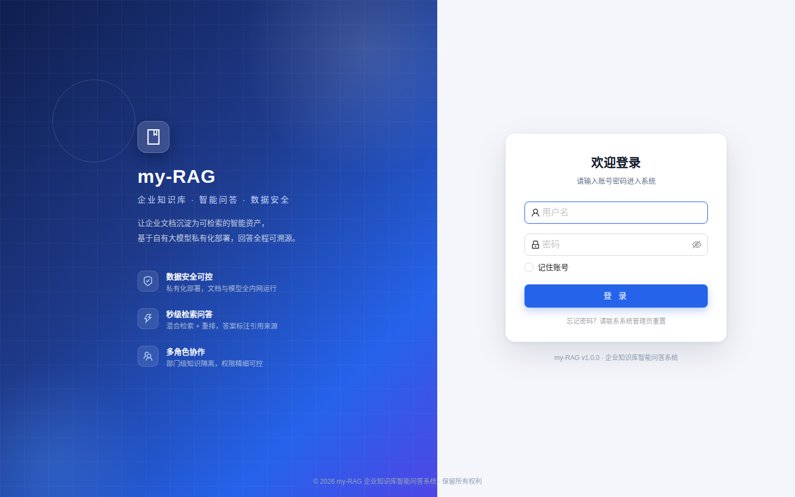
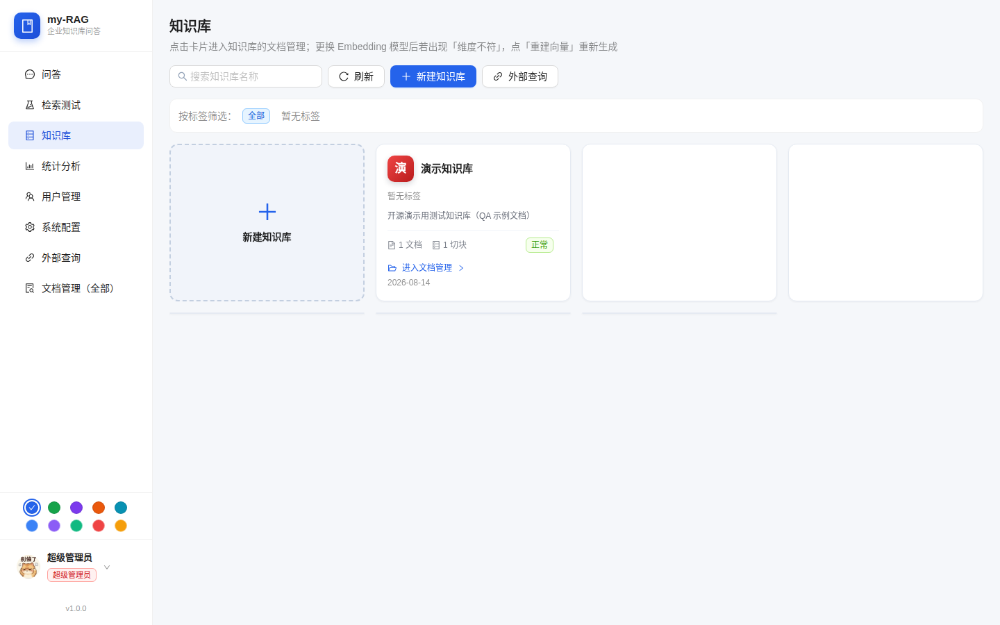
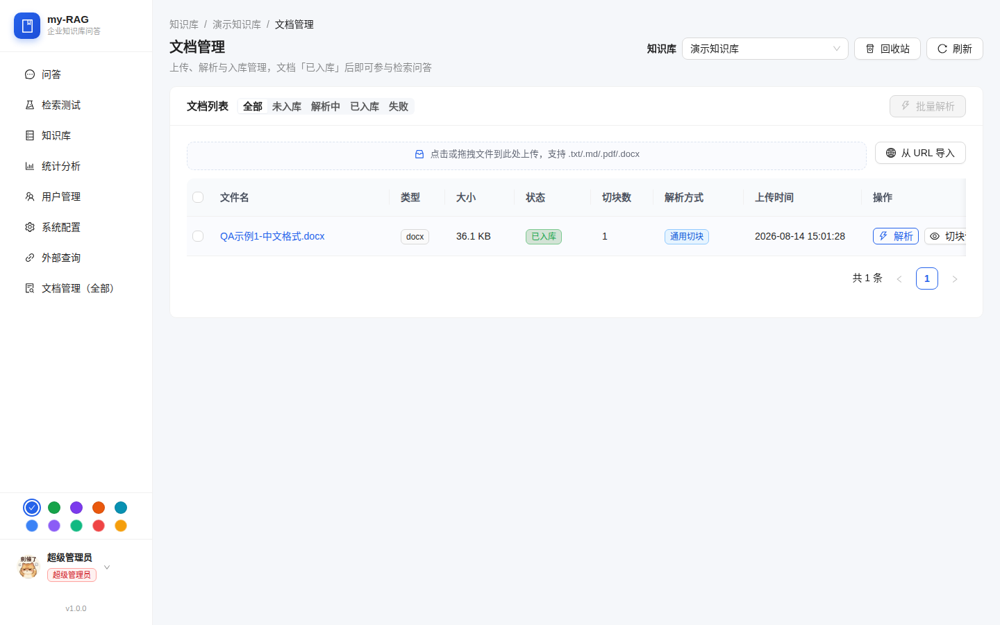
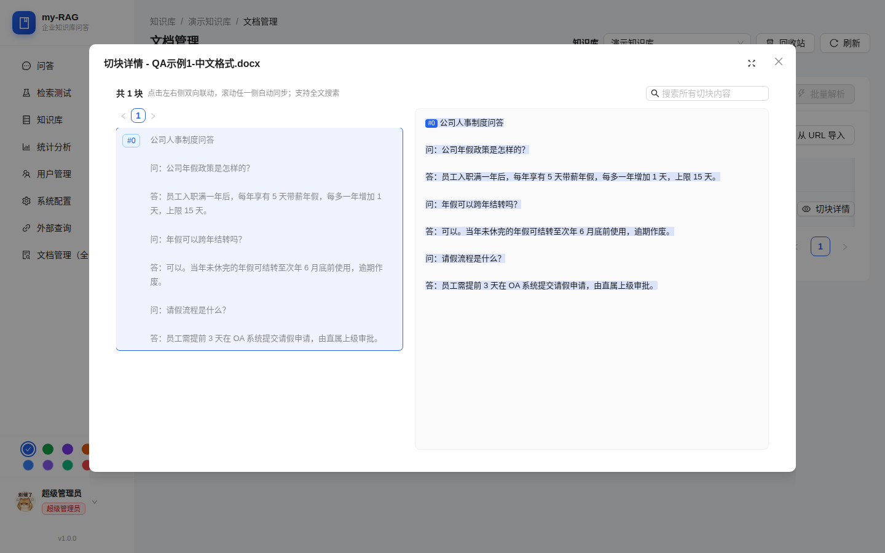
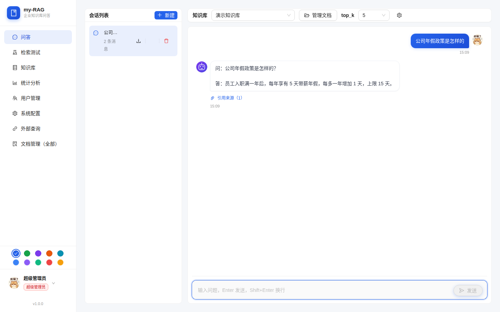
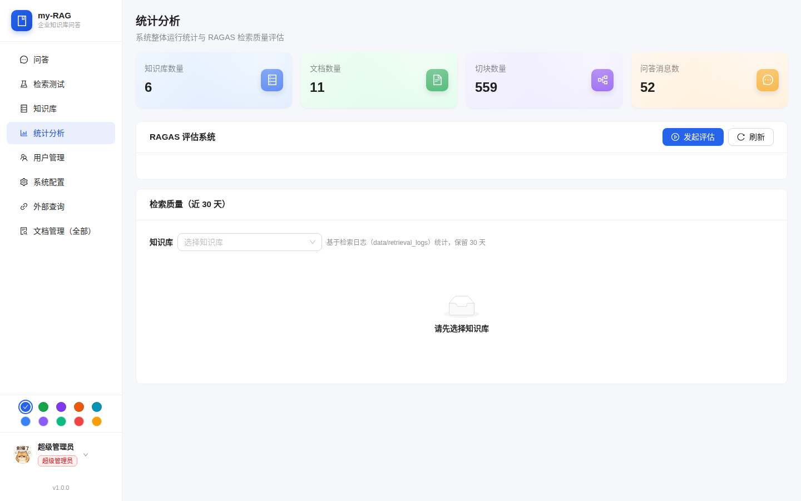

# my-RAG 知识库系统

基于 **Chroma 向量库 + bge-m3 Embedding + FastAPI + React/AntD** 的本地 RAG 知识库系统：
文档上传入库 → 向量检索 → 流式问答（强制引用溯源），接入 **RAGAS 评估闭环**、
**MinerU 文档解析**，并支持**多租户 + 团队协作**（MySQL / MinIO / JWT / 审计）。

## 功能全景

### 知识库与文档

- 知识库 CRUD（级联删除），多租户归属（部门 + 创建人），**标签体系**（设置/聚合/列表过滤，多选交集）
- 文档上传（txt/md/pdf/docx，≤100MB）+ **URL 网页导入** + 中文文件名安全（内部 UUID 命名）
- 解析方式可选：MinerU 高质量解析（含图片提取）/ 纯文本降级；切块方式：通用/按标题/正则/父子分块
- 文档**重命名**（改名即时生效）、原始内容预览（pdf 原生渲染 / 文本）
- **回收站**：软删除（检索自动排除、向量保留）→ 恢复（无需重新解析）→ 彻底删除（purge）/ 一键清空

### 检索与问答

- 向量检索（Chroma + bge-m3），**混合检索**（BM25 中文分词 + 向量 RRF 融合）
- **Rerank 重排序**（OpenAI 兼容 /rerank 协议，配置档案开启，需本地模型服务）
- 检索参数化：top_k / **多库对比检索（kb_ids，1~5 个库合并排序）** / 相似度阈值
- SSE 流式问答（meta→delta→done），强制引用溯源（句末 [n] + 来源片段），多轮对话
- 会话历史：列表/详情/删除/**重命名**/**导出 Markdown 附件**

### 企业级能力

- **多租户 + 团队协作**：用户 / 部门 / 知识库三表 MySQL，角色权限（super_admin / dept_admin / user），无权限 404 伪装防探测
- **审计日志**：全操作记录（登录/文档/知识库/会话/配置…），分页查询 + 过滤，仅超管可查
- **对象存储**：MinIO 存原始文档与解析图片（local 后端可离线），图片经鉴权代理输出（?token= 或 Bearer）
- **向量维度检测 + 一键重建**：实测 embedding 维度 vs 库内向量，不匹配可后台重建并轮询进度
- **检索质量统计**：近 30 天命中率 / 文档命中排行 / 零命中文档 / 日粒度
- **配置档案**：LLM/Embedding/MinerU/检索/切块/会话/MySQL/MinIO 多档案，切换即时生效 + 逐项连接测试

### 运维

- 一键部署脚本（源码 / Docker 双路径）、健康检查、日志审计、数据持久化（`data/` 或 MinIO）
- 端到端验证脚本 `scripts/verify.sh`（21 步，含全部新增功能）

## 界面预览

> 以下截图来自演示环境（演示知识库 + QA 示例文档），完整功能请自行部署体验。

| 页面 | 说明 |
| --- | --- |
|  | 登录页：用户名 / 密码登录（支持记住账号） |
|  | 知识库列表：卡片式展示，支持标签筛选 / 搜索 / 新建 / 外部查询 |
|  | 文档管理：上传、解析入库、切块状态一目了然 |
|  | 切块详情：左栏切块列表 + 右栏原文高亮，双向联动 |
|  | 流式问答：强制引用溯源，回答句末 [n] 引用标 + 来源片段 |
|  | 统计分析：系统运行统计 + RAGAS 检索质量评估 |

## 架构

```
前端 React18 + AntD5 (dev 3002 / 生产 nginx 托管 dist)
        │  /api 反向代理
后端 FastAPI (8091)   ←── 路由层: auth/users/departments/kbs/documents/chat/stats/settings/files/audit
        │
        ├── services 层（模块化，可单独替换）
        │   ├── kb_service / document_service   元数据（data/kbs、data/documents）+ MySQL 三表
        │   ├── vector_store                    Chroma 嵌入式（data/chroma，collection kb_{id}）
        │   ├── embedding_service               bge-m3（批量 32 / 截断 8000 字符）
        │   ├── parser_client                   MinerU（不可用自动降级 pypdf/python-docx）
        │   ├── ingestion_service               上传→解析→切块→向量化 状态机
        │   ├── retrieval_service / chat_service 向量+BM25 混合 / rerank / SSE 流式（引用标注）
        │   ├── bm25 / rerank_client            混合检索与重排序
        │   ├── dim_check                       向量维度检测 + 后台重建任务
        │   ├── retrieval_log                   检索质量日志（近 30 天）
        │   ├── stats_service / ragas_client    自身统计 + RAGAS(8090) 只读对接
        │   ├── settings_service                配置档案（data/settings.json，多档案+连接测试）
        │   ├── audit_service                   审计日志（MySQL）
        │   ├── storage_service                 对象存储（MinIO / local）
        │   ├── auth_service / user_service / department_service / kb_service（多租户）
        │   └── web_importer                    URL 网页导入
        │
        ├── 外部服务（OpenAI 兼容协议）
        │   ├── LLM:    qwen3.6-35b-a3b-apex-quality @ 127.0.0.1:1234/v1 (LM Studio)
        │   ├── Embedding: bge-m3 (dim=1024) @ 127.0.0.1:8300/v1 (vLLM)
        │   ├── Rerank: 需本地模型服务（配置档案开启，见 docs/部署说明）
        │   ├── MinerU: http://127.0.0.1:8001（Docker 部署）
        │   ├── MySQL:  127.0.0.1:5455（多租户三表）
        │   └── MinIO:  127.0.0.1:9000（对象存储）
        └── RAGAS 评估系统 @ http://localhost:8090（只读对接：任务列表 + 报告）
```

关键机制：

- **配置即时生效**：外部服务地址/模型/参数全部在「系统配置」页可改、可测、可多档案切换，
  保存后无需重启；运行时各 service 每次调用动态读取活跃档案（.env 仅作出厂默认值）。
- **幻觉抑制**：system prompt 强制「只依据引用回答 + 句末 [n] 标注来源 + 无答案明说」。
- **状态机**：文档 uploaded → parsing → parsed → ingested / failed，前端轮询展示。
- **软删除**：DELETE 文档 = 移入回收站（向量/存储保留，检索排除），purge 才物理删除。
- **中文路径安全**：文件内部统一 UUID 命名，原名仅存 JSON（ensure_ascii=False）。

## 快速开始

### 必改清单（首次部署前逐项确认）

> 详细说明（各服务的获取方式 / 端口 / 可降级性）见 **`docs/external-deps.md`**。

1. **JWT_SECRET**：`cp .env.example .env` 后，必须把 `.env` 中 `JWT_SECRET`
   改为 ≥16 字符的强随机值（`openssl rand -hex 32` 生成），否则后端**拒绝启动**。
2. **MySQL 连接**：登录/多租户依赖 MySQL，未配置则无法登录。填写
   `MYSQL_HOST` / `MYSQL_PORT` / `MYSQL_USER` / `MYSQL_PASSWORD` /
   `MYSQL_DATABASE`（Docker 部署填 `docker/.env.docker`；也可用
   `docker compose -f docker/docker-compose.infra.yml up -d mysql` 一键起库）。
3. **MinIO 或 local 存储**：有 MinIO 则填 `MINIO_ENDPOINT` / `MINIO_ACCESS_KEY` /
   `MINIO_SECRET_KEY`（或 `docker compose -f docker/docker-compose.infra.yml
   up -d minio` 一键启动）；无 MinIO 时设 `STORAGE_BACKEND=local`
   （对象存本地 `data/storage`）。

### 路径一：源码部署（dev 开发，热更新，推荐日常开发）

所有部署脚本统一放在 `deploy/` 目录（install.sh 装依赖 / build.sh 编译前端 /
start.sh 启动 / stop.sh 停止）：

```bash
./deploy/install.sh   # 首次：创建 .venv → 装后端依赖 → 装前端依赖（幂等）
./deploy/start.sh     # 建/复用 .venv → 装依赖 → 构建前端 → 起后端 8091 → 起前端 dev 3002
./deploy/stop.sh      # 停止前后端
```

- 后端 API: http://localhost:8091 （健康检查 `/api/health`）
- 前端: http://localhost:3002

手动模式（不依赖脚本）：
```bash
# 后端（Python 3.12）
python3.12 -m venv .venv && .venv/bin/pip install -r requirements.txt
PYTHONPATH=. .venv/bin/python -m uvicorn backend.main:app --host 0.0.0.0 --port 8091 --reload

# 前端（Node 22）
cd frontend && npm install && npm run dev
```

> requirements.txt 有增删后需强制重装：`./deploy/install.sh --force`

### 路径二：Docker 部署（生产）

```bash
cp docker/.env.docker.example docker/.env.docker   # 生成后编辑 docker/.env.docker
docker compose -f docker/docker-compose.yml up -d --build   # 构建并后台启动
docker compose -f docker/docker-compose.yml logs -f         # 查看日志
docker compose -f docker/docker-compose.yml down            # 停止（数据卷 ../data 保留）
```

- 前端: http://localhost （nginx，SPA 路由 + /api 反代 8091）
- 后端 API: http://localhost:8091/api/health
- 详细说明（含配置字段、Rerank 档案配置、已知限制）见 `docker/README.md`

### 端到端验证

```bash
# 后端 8091 运行中时执行（自建数据、自清理；网络/外部依赖不可用步骤自动 SKIP）
bash scripts/verify.sh
```

## API 文档

完整接口契约见 **`docs/api_contract.md`**（v1.2），包含：全局约定（认证/角色/错误码）、
用户/部门管理、知识库、文档、聊天、统计、审计、文件代理、系统配置。

快速索引：

| 模块 | 接口 |
|---|---|
| 认证 | `POST /api/auth/login` `GET /api/auth/me` `POST /api/auth/change-password` |
| 用户/部门 | `/api/users`（CRUD，仅超管） `/api/departments`（CRUD，仅超管） |
| 知识库 | `GET/POST /api/kbs` `GET/PUT/DELETE /api/kbs/{id}` `GET /api/kbs?tag=` |
| 标签 | `GET /api/kbs/tags` `PUT /api/kbs/{id}/tags` |
| 向量重建 | `GET /api/kbs/{id}/vector-status` `POST /api/kbs/{id}/rebuild-vectors` `GET /api/kbs/{id}/rebuild-status` |
| 文档 | `POST /documents/upload` `POST /documents/from-url` `POST /documents/{id}/ingest` `POST /documents/{id}/rename` `GET /documents/{id}/raw` `GET /documents` `GET /documents/{id}` |
| 回收站 | `GET /documents/trash` `POST /documents/trash/empty` `DELETE /documents/{id}`（软删） `POST /documents/{id}/restore` `POST /documents/{id}/purge` |
| 聊天 | `POST /api/chat/stream`（SSE） `POST /api/chat/retrieve`（含 kb_ids/混合/重排/阈值） `GET /api/chat/history` `GET/DELETE /api/chat/history/{id}` `POST /api/chat/history/{id}/rename` `GET /api/chat/history/{id}/export` |
| 统计 | `GET /api/stats` `GET /api/stats/quality?kb_id=` `GET /api/stats/ragas` `GET /api/stats/ragas/tasks/{id}` |
| 审计 | `GET /api/audit/logs` `GET /api/audit/actions`（仅超管） |
| 文件 | `GET /api/files/images/{doc_id}/{name}?token=`（或 Bearer） |
| 配置 | `GET/POST/PUT/DELETE /api/settings/profiles` `POST /profiles/{id}/activate` `POST /profiles/{id}/test` `GET /api/settings/embedding-dim` |
| 健康 | `GET /api/health` |

## 配置说明

### .env（出厂默认值，运行时以配置档案优先）

复制 `.env.example` 为 `.env` 可覆盖出厂默认：端口/LLM/Embedding/MinerU/检索/切块/
MySQL/MinIO/STORAGE_BACKEND/JWT_SECRET。**运行时配置请在网页「系统配置」页修改**，
多档案持久化于 `data/settings.json`，切换档案即时生效。

### 系统配置页（数据档案，持久化到 data/settings.json）

每档案包含：LLM（base_url/api_key/model/temperature/max_tokens）、Embedding、
MinerU、检索（top_k / similarity_threshold / enable_hybrid / **rerank**）、
切块（chunk_size/chunk_overlap）、会话、MySQL、MinIO。

- **Rerank**：检索分组下 `rerank` 段（enabled + base_url + model + top_n），
  需本地部署 OpenAI 兼容 /rerank 模型服务；未配置自动跳过重排（严格降级）
- **测试连接**：LLM/Embedding/MySQL/MinIO 各 5s 超时，MinerU 3s，逐项返回 成功(绿)/失败(红) + 耗时
- **api_key 脱敏**：接口返回脱敏值（前4\*\*\*\*后4）；编辑时未修改则保存保留原值

## 外部系统对接

### RAGAS 评估系统（端口 8090）

- 只读对接：`效果展示` 页展示 RAGAS 任务列表与评估报告（aggregate.scores + 逐样本评分）
- RAGAS 未运行时自动降级：页面 Alert 提示，自身统计不受影响
- 地址通过环境变量 `RAGAS_BASE_URL` 配置

### MinerU 文档解析（端口 8001）

- pdf/docx 优先走 MinerU 高质量解析（含图片提取，图片经 `/api/files/images/` 鉴权代理输出）；
  MinerU 未启动时自动降级 pypdf/python-docx 纯文本提取（文档详情 `parse_method`：`mineru` / `plain`）
- 扫描版 PDF 纯文本提取为空时状态置 `failed` 并提示「请启动 MinerU」

## 已知限制

- **MinerU 图片链路已打通**（解析 → MinIO/local 存储 → 鉴权代理输出）；图片提取需
  MinerU 侧开启 return_images，且需知识库权限（无权限 404 伪装）
- **Rerank 需本地模型服务**（OpenAI 兼容 /rerank 协议，如 vLLM rerank 接口），
  系统不内置模型；未配置时检索自动跳过重排
- **MySQL IP 白名单**：MySQL 用户若配置来源 IP 白名单，需放行部署机（源码部署）
  或 docker 网关网段（Docker 部署），否则后端启动建库失败
- 系统默认 `python3` 可能是旧版本（如 3.7），请使用 `/usr/local/bin/python3.12`
  创建虚拟环境（install.sh 已自动优先）

## 目录结构

```
my-RAG/
├── deploy/            # 源码部署脚本（install/build/start/stop + 说明）
├── docker/            # Docker 部署（Dockerfile×2 / compose / nginx.conf / .env.docker / README）
├── docs/api_contract.md  # API 契约（v1.2，全部接口）
├── scripts/verify.sh  # 端到端验证（21 步）
├── tests/             # pytest（90+ 测试文件 / 900+ 用例，离线可跑）
├── README.md / .gitignore / .dockerignore
├── requirements.txt / requirements-dev.txt / .env.example
├── backend/
│   ├── main.py config.py deps.py db.py
│   ├── models/        rag_models.py user_models.py
│   ├── routers/       auth users departments knowledge_bases documents chat stats settings files audit
│   ├── services/      kb document vector_store embedding parser ingestion retrieval chat bm25
│   │                  rerank_client dim_check retrieval_log ragas_client settings audit storage
│   │                  auth user department web_importer
│   └── chunking/splitter.py
├── frontend/src/      App.tsx api/client.ts components/ pages/
└── data/              uploads/ parsed/ kbs/ documents/ chat/ chroma/ storage/ settings.json（运行时，gitignore）
```
